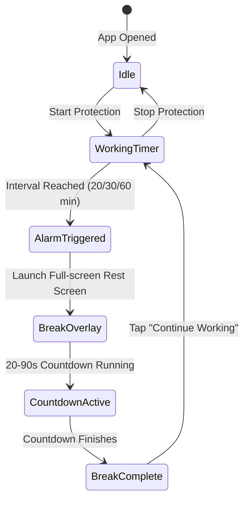

<p align="center">
  
</p>

<h1 align="center">EyeGuard</h1>

<p align="center">
  <strong>Offline-first, non-intrusive Android utility designed to prevent digital eye strain during intense screen usage.</strong><br>
  Enforces the proven 20-20-20 rule with peaceful, full-screen break overlays.
</p>

<p align="center">
  <a href="#-english">English</a> • <a href="#-فارسی">فارسی</a>
</p>

<p align="center">
  <a href="https://github.com/sajjadele/eye_guard/releases/latest">
    
  </a>
  
  
  
  
  
</p>

---

## 🌐 Language Navigation / تغییر زبان
- [🇬🇧 English Documentation](#-english)
- [🇮🇷 مستندات و معرفی فارسی](#-فارسی)

---

# 🇬🇧 English

## 💡 Product Philosophy

Prolonged screen sessions cause severe eye fatigue, dry eyes, and tension headaches (Computer Vision Syndrome). Eye doctors recommend the **20-20-20 Rule**: *every 20 minutes, look at an object at least 20 feet away for 20 seconds.*

Most reminder apps fail because notifications are too easy to swipe away and ignore. **EyeGuard** takes a gentle but firm approach: it places a non-intrusive visual resting overlay over your screen, giving your eyes a genuine pause.

### 🛡️ Non-Negotiable Principles

| # | Principle | Description |
|---|-----------|-------------|
| 1 | **100% Offline** | Zero network calls. No telemetry, no third-party SDKs, no cloud dependencies. |
| 2 | **Zero Friction** | No accounts, no onboarding mazes, no paywalls, and absolutely no ads. |
| 3 | **Unignorable Rest** | The break overlay cannot be accidentally swiped away until the timer completes. |
| 4 | **Battery & System Friendly** | Uses Android's native `AlarmManager` and low-overhead foreground service. |
| 5 | **Native Experience** | Built entirely with modern Jetpack Compose Material 3 design tokens. |

---

## ⚙️ How It Works



1. **Activate Protection:** Select your preferred working interval (e.g. 20, 30, or 60 min) and break duration (e.g. 20, 30, or 60 sec).
2. **Focus on Work:** A discreet foreground service monitors the elapsed time without draining battery.
3. **Take a Break:** When time is up, a peaceful dark overlay smoothly covers the screen with an eye relaxation timer.
4. **Resume Flow:** Once the rest countdown completes, tap **"Continue Working"** to return right where you left off.

---

## ✨ Features

<table>
<tr>
<td width="50%" valign="top">

### 🎯 Core Capabilities
- **Flexible Intervals:** Work periods (20, 30, 60 min) & Rest periods (20, 30, 60, 90 sec).
- **Foreground Reliability:** Uses native Android services to prevent the OS from killing the timer in the background.
- **Accurate Scheduling:** Leverages `AlarmManager` for precise timing even in doze mode.
- **Accidental Dismiss Prevention:** Prevents unconscious muscle-memory dismissals during breaks.

</td>
<td width="50%" valign="top">

### 🎨 Modern Architecture
- **100% Jetpack Compose:** Declarative UI with Material 3 design standards.
- **StateFlow & Coroutines:** Reactive, lifecycle-aware architecture (MVVM).
- **DataStore Preferences:** Fast, type-safe on-device storage.
- **Automated CI/CD:** Cloud-built APKs with GitHub Actions.

</td>
</tr>
</table>

---

## 📲 Download & Installation

You can download the pre-compiled, verified release directly:

<p align="center">
  <a href="https://github.com/sajjadele/eye_guard/releases/latest">
    
  </a>
</p>

### Required Permissions Explained

EyeGuard requires only the minimum permissions necessary to function:
* `SYSTEM_ALERT_WINDOW` (*Display over other apps*): To present the visual resting screen when a break is due.
* `POST_NOTIFICATIONS` (Android 13+): To show the active protection status in the notification panel.
* `FOREGROUND_SERVICE`: To ensure the work timer continues reliably while you use other apps.
* `SCHEDULE_EXACT_ALARM`: For exact interval timing without battery-intensive polling loops.

---

## 🏗️ Architecture & Tech Stack

```
com.example.eyeguard
├── data
│   ├── preferences     # DataStore preferences & keys
│   └── repository      # Repository implementations
├── domain
│   ├── models          # EyeGuardSettings and data models
│   └── usecases        # ObserveSettingsUseCase, UpdateSettingsUseCase
├── presentation
│   ├── components      # Reusable Compose widgets
│   ├── screens         # Main screen & settings UI
│   └── theme           # Material3 typography & colors
└── service
    ├── BreakOverlay    # Compose overlay rendered via WindowManager
    └── EyeProtectionService # Android Foreground Service lifecycle
```

---

# 🇮🇷 فارسی

## 💡 چرا EyeGuard؟ (فلسفه ساخت محصول)

نشستن مداوم پای مانیتور و گوشی باعث خستگی مزمن چشم، خشکی قرنیه و سردردهای تنشی می‌شود (سندروم بینایی رایانه). چشم‌پزشکان در سراسر جهان یک راه‌حل ساده و اثبات‌شده دارند: **قاعده ۲۰-۲۰-۲۰**:  
> *«هر ۲۰ دقیقه، به مدت ۲۰ ثانیه، به فاصله‌ای در حدود ۲۰ فوت (۶ متر) نگاه کنید.»*

بیشتر برنامه‌های یادآور شکست می‌خورند چون با یک نوتیفیکیشن ساده هشدار می‌دهند و مغز ما ناخودآگاه آن را می‌بندد و به کار ادامه می‌دهد. **EyeGuard** برای حل این مشکل طراحی شده است: وقتی زمان استراحت فرا می‌رسد، یک صفحه تمام‌صفحه آرامش‌بخش و تاریک به آرامی روی صفحه ظاهر می‌شود تا واقعاً به چشمانتان استراحت دهید.

---

### 🛡️ اصول غیرقابل مذاکره ما

1. **۱۰۰٪ آفلاین:** هیچ اتصال اینترنتی، ارسال داده، آنالیتیکس یا کتابخانه رهگیری وجود ندارد.
2. **بدون تبلیغات و بدون هزینه:** بدون نیاز به ساخت حساب کاربری یا پرداخت درون‌برنامه‌ای.
3. **استراحت واقعی:** تا پایان ثانیه‌شمار استراحت، صفحه ناخواسته بسته نمی‌شود تا استراحت چشم حفظ شود.
4. **بهینه برای باتری:** استفاده از ابزارهای بومی اندروید (`AlarmManager`) برای صفر کردن مصرف باتری در پس‌زمینه.

---

### ✨ امکانات و قابلیت‌ها

*   ⏱️ **تنظیم دلخواه زمان:** انتخاب زمان کار (۲۰، ۳۰ یا ۶۰ دقیقه) و زمان استراحت (۲۰، ۳۰، ۶۰ یا ۹۰ ثانیه).
*   📱 **صفحه استراحت هوشمند (Overlay):** نمایش لایه نیمه‌شفاف با انیمیشن ملایم روی تمام برنامه‌ها.
*   🔋 **مصرف باتری بسیار پایین:** مدیریت دقیق با Foreground Service بدون درگیر کردن دائمی پردازنده.
*   🎨 **طراحی مدرن Material 3:** رابط کاربری شکیل و هماهنگ با طراحی روز اندروید با استفاده از Jetpack Compose.

---

### 📲 دانلود و نصب مستقیم

فایل نصب رسمی و امضاشده اپلیکیشن را بدون نیاز به گوگل‌پلی یا کامپایل دستی دانلود کنید:

<p align="center">
  <a href="https://github.com/sajjadele/eye_guard/releases/latest">
    
  </a>
</p>

#### دسترسی‌های مورد نیاز:
* **نمایش روی سایر برنامه‌ها (Overlay):** برای اینکه صفحه استراحت هنگام موعد مقرر بتواند روی برنامه‌های در حال اجرا نمایش داده شود.
* **نوتیفیکیشن:** برای اطلاع‌رسانی از وضعیت فعال بودن محافظت چشم در نوار اعلان‌ها.

---

## 👨‍💻 توسعه‌دهنده (Author)

طراحی و توسعه داده‌شده توسط **سجاد شاکری (Sajjad Shakeri)**  
- 🐙 GitHub: [@sajjadele](https://github.com/sajjadele)
- 💬 Telegram: [@sajjadele85](https://t.me/sajjadele85)
- 🐦 X (Twitter): [@sajjad413835585](https://x.com/sajjad413835585)

## 📄 مجوز (License)

این پروژه تحت مجوز متن‌باز **MIT** منتشر شده است. استفاده، فورک و مشارکت برای عموم آزاد است.
