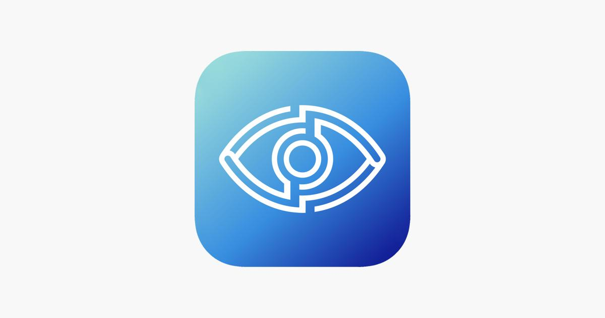

  

# EyeGuard

  
  
  
  

EyeGuard is an offline-first Android app that reminds users to rest their eyes during long phone usage.

After a configured work interval, EyeGuard shows a full-screen break overlay above other apps and forces a short visual break.

---

## MVP Features

- Configure work interval: 20 / 30 / 60 minutes
- Configure break duration: 30 / 60 / 90 seconds
- Start and stop eye protection
- Runs using a foreground service
- Schedules breaks using AlarmManager
- Shows a full-screen overlay break screen above other apps
- Countdown cannot be accidentally dismissed
- After countdown finishes, user taps **Continue Working**
- Work timer restarts automatically
- Fully offline

No analytics, accounts, cloud sync, ads, AI, or health tracking.

---

## How the App Works

1. User opens EyeGuard
2. User grants required permissions
3. User selects work interval and break duration
4. User taps **Start Protection**
5. EyeGuard starts a foreground service
6. The service schedules the next break using AlarmManager
7. When the break time arrives, the service shows a full-screen overlay
8. The overlay counts down and the user cannot accidentally dismiss it
9. When the countdown finishes, the overlay shows **Continue Working**
10. Tapping **Continue Working** closes the overlay and schedules the next work interval

---

## Required Permissions

- **Display over other apps** (SYSTEM_ALERT_WINDOW) - Required for break overlay
- **Notifications** (POST_NOTIFICATIONS) - Required on Android 13+
- **Foreground Service** (FOREGROUND_SERVICE, FOREGROUND_SERVICE_SPECIAL_USE)
- **Exact Alarm** (SCHEDULE_EXACT_ALARM) - Optional, improves timing accuracy
- **Wake Lock** (WAKE_LOCK) - Used during break screen

---

## How to Run

1. Open Android Studio
2. Create a new project (Empty Activity / Compose)
3. Use package name: `com.example.eyeguard`
4. Replace generated files with project files
5. Sync Gradle
6. Run on a physical Android device

**Minimum SDK:** 24
**Target SDK:** 34

---

## Tech Stack

- Kotlin
- Jetpack Compose
- Material 3
- MVVM
- Coroutines + StateFlow
- DataStore Preferences
- Foreground Service
- AlarmManager
- WindowManager overlay

---

## License

MIT
